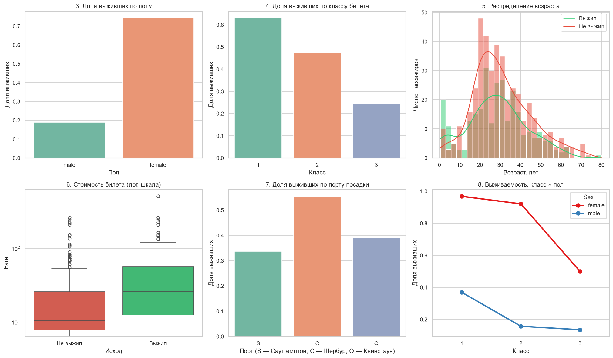
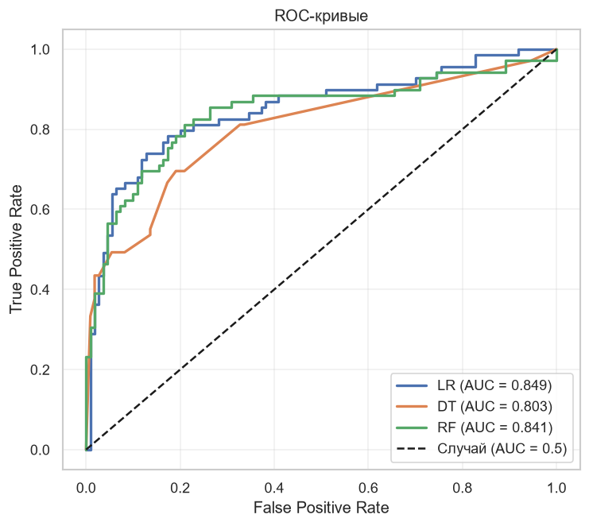
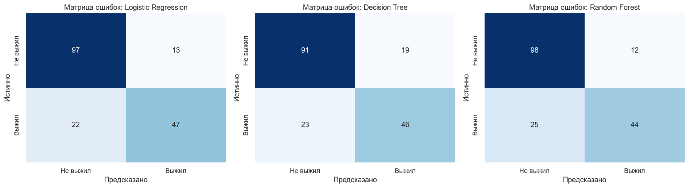

# 🚢 Module 1 — Titanic: EDA + бинарная классификация

**Автор:** Боттер Вадим Валерьевич, ПКТб-23-1  
**Дата обучения моделей:** 28.09.2026  
**Данные:** [Kaggle — Titanic: Machine Learning from Disaster](https://www.kaggle.com/c/titanic)

Полный цикл ML-проекта: разведочный анализ, обработка пропусков без утечки данных, Feature Engineering, обучение и сравнение моделей, интерпретация, сохранение и загрузка моделей из репозитория. Отчёт из 14 разделов — в [notebook.ipynb](./notebook.ipynb).

## 📊 Результаты

Метрики на проверочной части (20% `train.csv`, 179 пассажиров, стратифицированное разбиение, `random_state=42`):

| Модель | Accuracy | Precision | Recall | F1 | ROC-AUC |
|---|---|---|---|---|---|
| **Logistic Regression** | **0.804** | 0.783 | **0.681** | **0.729** | **0.849** |
| Decision Tree (max_depth=5) | 0.765 | 0.708 | 0.667 | 0.687 | 0.803 |
| Random Forest + GridSearchCV | 0.793 | **0.786** | 0.638 | 0.704 | 0.841 |

Главные факторы выживания: **пол**, **класс билета**, **возраст**. Время обучения и параметры — в [models/metrics.json](./models/metrics.json).





## 🚀 Быстрый старт
```bash
cd module-1-titanic
pip install -r requirements.txt
jupyter notebook notebook.ipynb
```
Ноутбук нужно запускать из папки `module-1-titanic` — пути к данным относительные.

Использование готовой модели без обучения:
```python
import joblib, json
lr = joblib.load('models/lr_model.pkl')
scaler = joblib.load('models/scaler.pkl')
le_sex = joblib.load('models/le_sex.pkl')
feature_cols = json.load(open('models/feature_cols.json'))
```
Функция `predict_passenger` для предсказания по данным нового пассажира — в разделе 9 ноутбука.

## 📁 Структура
```text
module-1-titanic/
├── README.md
├── notebook.ipynb          # отчёт из 14 разделов
├── requirements.txt
├── data/                   # train.csv, test.csv, submission.csv, titanic_info.md
├── models/                 # lr/dt/rf модели, scaler, le_sex, feature_cols.json,
│                           # preprocessing.json, metrics.json
└── examples/               # eda_plots.png, roc_curves.png, confusion_matrices.png
```
